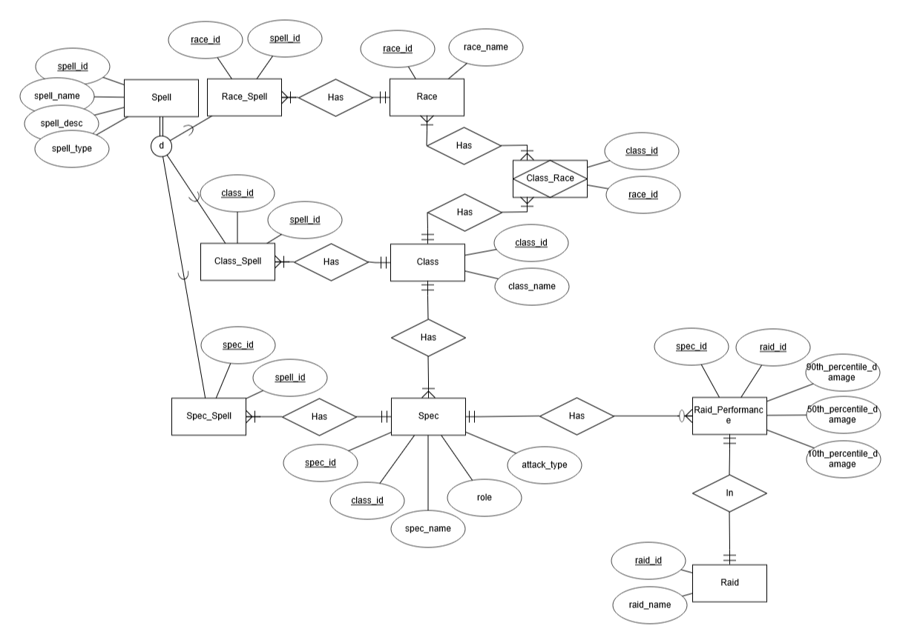
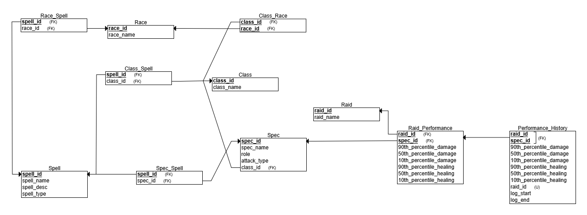

# Wow Database
Stores data on World of Warcraft (WoW) classes, each of their unique aspects, and their damage logs in raids

### Data Source
Class, specialization, race, and spell data is sourced from [Wowpedia](https://wowpedia.fandom.com), a wiki containing general WoW knowledge

Performance data is sourced from [Warcraft Logs](https://www.warcraftlogs.com), a site tracking millions of logs from WoW players

### Query Interface
Simple interface for queries built in Visual Studio using C# and XAML

[Demo Video](src/demo.mp4)

### Entity Relationship Diagram

### Relational Schema

